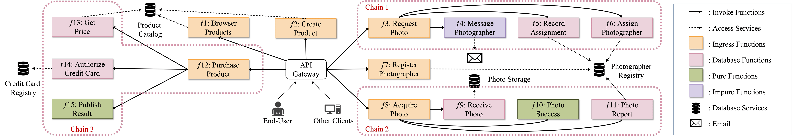

# Hello, Retail! - QFaaS

_Hello, Retail!_ is originally a Nordstrom Technology open-source project. (Unfortunately, the 
original [repository](https://github.com/Nordstrom/hello-retail) has been
removed.) 

> Hello, Retail! is a Nordstrom Technology open-source project. Hello, Retail! is a 100% serverless, event-driven framework and functional proof-of-concept showcasing a central unified log approach as applied to the retail problem space. All code and patterns are intended to be re-usable for scalable applications large and small.

The original implementation targets the AWS Lambda platform. In this repository, we port it into the QFaaS/OpenFaaS platform to evaluate the efficiency of QFaaS in real-world production.

We reused some legacy open-source code from
[Ethos-lab/Valve](https://github.com/Ethos-lab/Valve),
[STS-Lab/WILL.IAM](https://bitbucket.org/sts-lab/will.iam/src/master/), and the
original implementation from Nordstrom for AWS Lambda. We sincerely appreciate their contributions and sharing.

## Serverless Functions

The architecture of serverless application _Hello, Retail!_ is shown in the 
figure below:

To reflect above functions in our implementations, we attach a table showing 
the mapping including brief descriptions and attributes.

|Function (Architecture)|Function\[Resource\] (Implementation)|Description|Attributes|
|-----------------------|-------------------------|-----------|----------|
|Register Photographer|photo-register|Register a photographer that can be assigned later|Ingress, Access DB|
|Request Photo|photo-request|As a "step function" chaining the next three functions|Ingress|
|Assign Photographer|photo-assign|Select a photographer from DB and assign them to a product|Access DB|
|Message Photographer|photo-message|Send an email to the assigned photographer via SMTP|Call SMTP|
|Record Assignment|photo-record|Create an assignment pending record in DB|Access DB|
|Acquire Photo|photo-acquire|As a "step function" chaining the next three functions|Ingress|
|Receive Photo|photo-receive|Receive a photo (link/binary) from the photographer for an assignment|Access DB|
|Photo Success|photo-success|Indicate a successful receipt|/|
|Photo Report|photo-report|Complete the pending assignment|Access DB|
|Create Product|product-api-builder/product|Create a new product in DB|Ingress, Access DB|
|Browser Product|product-api/<products/categories>|List products/categories|Ingress, Access DB|
|/|product-purchase-add-cc|Add a credit card entity. In real productions, the system will call a third-party authority to authorize the credit card|Internal use, Access DB|
|Purchase Product|product-purchase|As a "step function" chaining the next three functions|Ingress|
|Get Price|product-purchase-get-price|Get price of a product|Access DB|
|Authorize Credit Card|product-purchase-authorize-cc|Authorize the credit card info|Access DB|
|Publish Report|product-purchase-publish|Synthesize the purchase result|/|

## Request Samples

Exampled can be checked on this [site](https://documenter.getpostman.com/view/5261051/TzCL7nxf#9efe1c47-4444-44dc-8039-0c8814d47b16).
